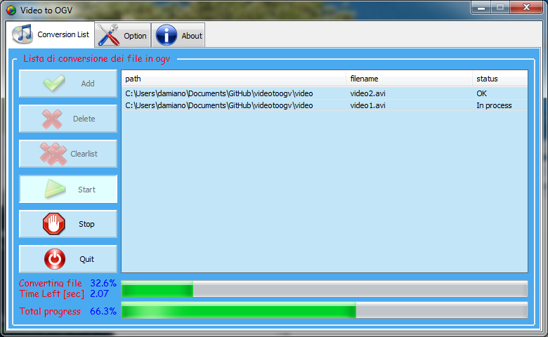

Video To Ogv
============

Simple program to convert any 
file video in file ogv with 
codec theora.

Developed by Damiano Lollini 
in Python using wxPython as 
the GUI toolkit.
Tested on Windows and Linux.

--------------------

## Download project

	git clone git@github.com:damnemo/videotoogv.git
	git clone git://github.com/damnemo/videotoogv.git

----------

## Requirements
 1. Python 2.7
 2. [WxPython](http://www.wxpython.org/)
 3. [Psutil module for Python](https://code.google.com/p/psutil/)

----------

## Files and Folders Contents
 1. **Codec**, ffmpeg2theora for linux and windows.
 2. **img**, icons and images, These files are not necessary for the operation      of the program, because they have been replaced by the file `images.py`
 3. **images.py**, was created by the script `img\img2py-script.py`
 4. **main.py**, main program 

----------

## How to
#### Install the programs and the required modules before.

####  - Linux
Setup files permission, you need to use chmod command to dir:
`chmod -R 777 videotoogv`
then click on `main.py`

####  - Windows
click on `main.py`, rename the file in `main.pyw` to avoid console window

----------

### Image Preview

